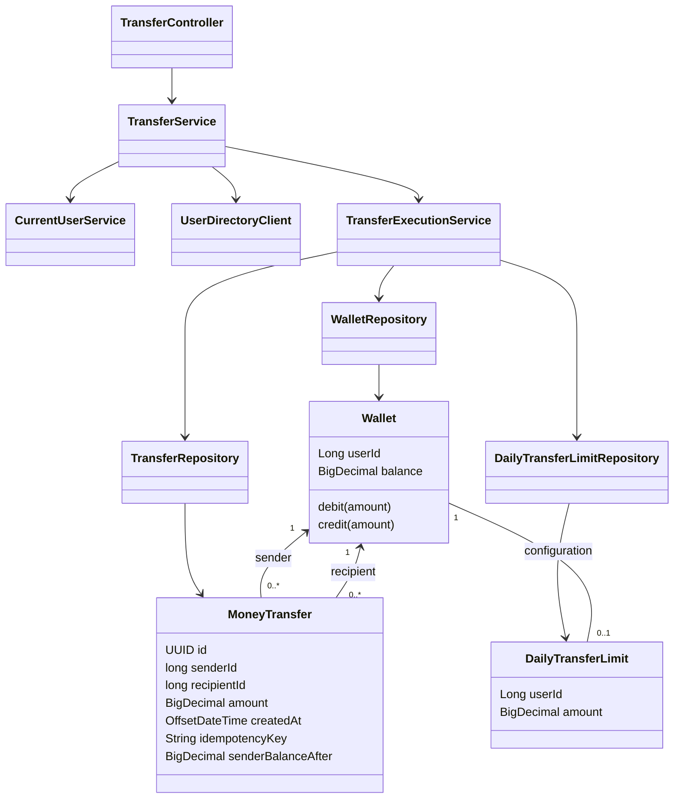

## Class diagram

This shows the core transfer classes and database associations. Wallet links
represent foreign keys; entities store user IDs rather than JPA object references.

```mermaid
classDiagram
    class Wallet {
        Long userId
        BigDecimal balance
        debit(amount)
        credit(amount)
    }
    class MoneyTransfer {
        UUID id
        long senderId
        long recipientId
        BigDecimal amount
        OffsetDateTime createdAt
        String idempotencyKey
        BigDecimal senderBalanceAfter
    }
    class DailyTransferLimit {
        Long userId
        BigDecimal amount
    }
    TransferController --> TransferService
    TransferService --> CurrentUserService
    TransferService --> UserDirectoryClient
    TransferService --> TransferExecutionService
    TransferExecutionService --> WalletRepository
    TransferExecutionService --> TransferRepository
    TransferExecutionService --> DailyTransferLimitRepository
    WalletRepository --> Wallet
    TransferRepository --> MoneyTransfer
    DailyTransferLimitRepository --> DailyTransferLimit
    Wallet "1" <-- "0..*" MoneyTransfer : sender
    Wallet "1" <-- "0..*" MoneyTransfer : recipient
    Wallet "1" -- "0..1" DailyTransferLimit : configuration
```
